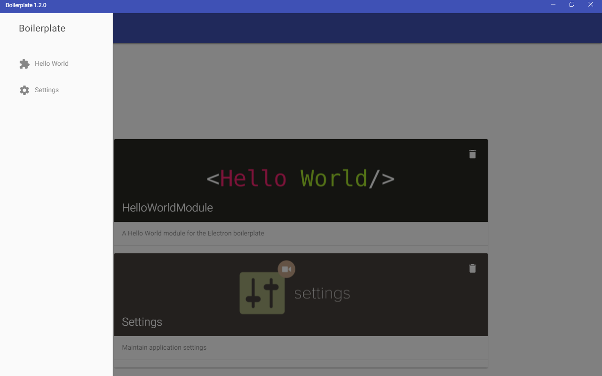

# electron-boilerplate
An electron boilerplate project incl. PouchDB, React + NuclearJS, Grommet UI Framework

## Included modules
* [Electron](http://electron.atom.io)
* [ReactJS](http://facebook.github.io/react/)
* [React-Router](https://github.com/reactjs/react-router)
* [NuclearJS](https://optimizely.github.io/nuclear-js/) (ImmutableJS and Flux-based architecture)
* [Grommet UI framework](http://www.grommet.io/)
* [PouchDB](https://pouchdb.com/) + Plugins (geo-spatial, MongoDB-style query language and full-text search engine support)

## Getting started
* install node.js (at least Node 4.4.x+ and NPM 2.14.x+ required) from [here](http://www.nodejs.org)
* install Git from [here](https://git-scm.com/)
* install Python 2.7 from [here](http://www.python.org) and add the installation directory to your system path variable
* For Windows, install Windows SDK for Windows Server 2008 and .NET Framework 3.5 from [here](http://www.microsoft.com/en-us/download/details.aspx?id=11310)
* For Windows, install Visual Studio 2013/2015 (Express for Desktop is sufficient).
* clone git repository (```git clone -b reactjs https://github.com/appelgriebsch/electron-boilerplate.git```)
* open terminal and run ```npm install``` to install dependencies
* start application in debug by executing ```npm start``` in terminal

## Screenshot



## Build Distributable Packages

**PLEASE NOTE: you will need a virtual machine with the actual operating system and development tools installed to build the native packages for it**

* on OS X (10.9+): creates application bundle and distributable disk image (x64 only, Mac AppStore compatible variant incl.)

  ```bash
  npm run build:osx             // will execute sub-tasks npm run build:osx-app (standalone) and npm run build:osx-mas (Mac AppStore version)
  ```
* on Windows (7+): creates application .exe and distributable setup.exe (x86 and x64)

  ```bash
  npm run build:win32         // will execute sub-tasks npm run build:win32-ia32 and npm run build:win32-x64
  ```
* on Linux (Ubuntu/Fedora): creates application and distributable packages for deb-style and rpm-style distributions (x86 and x64)

  ```bash
  npm run build:linux       // will execute sub-tasks npm run build:linux-ia32 and npm run build:linux-x64
  ```
